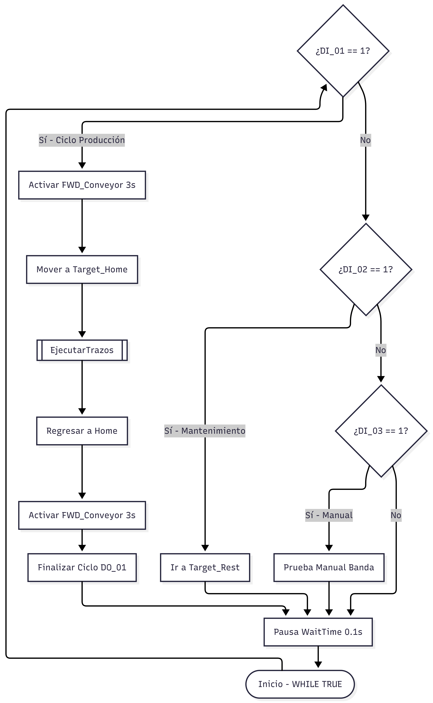
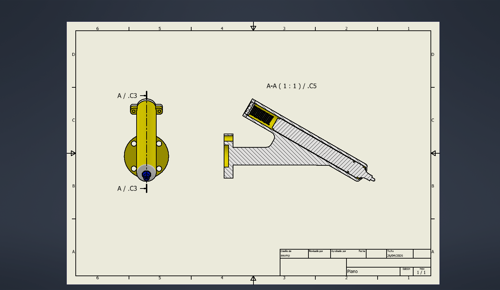
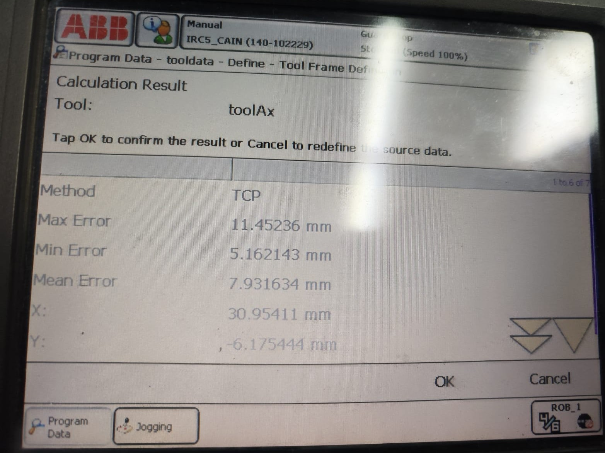
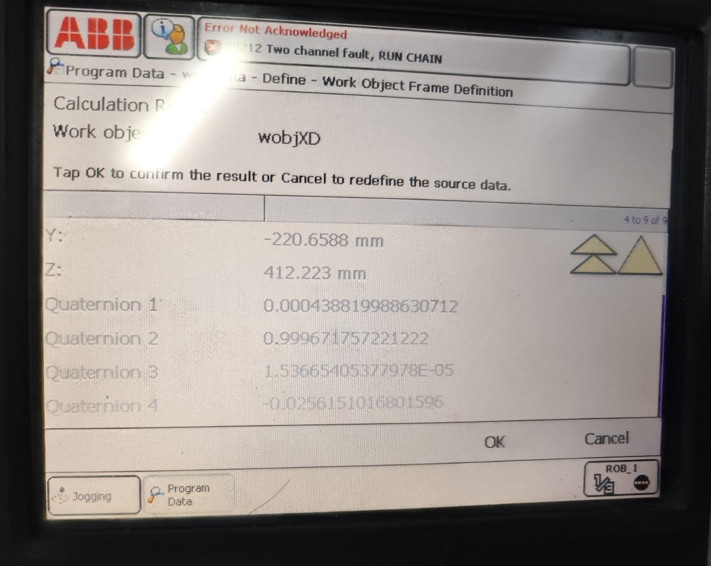
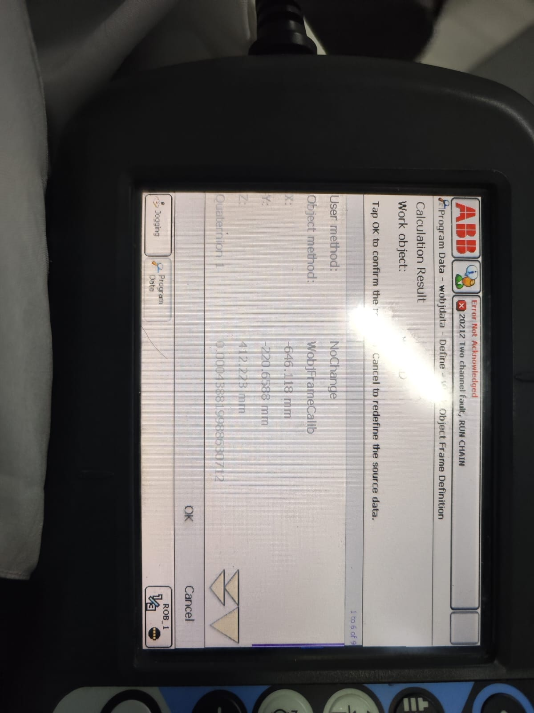
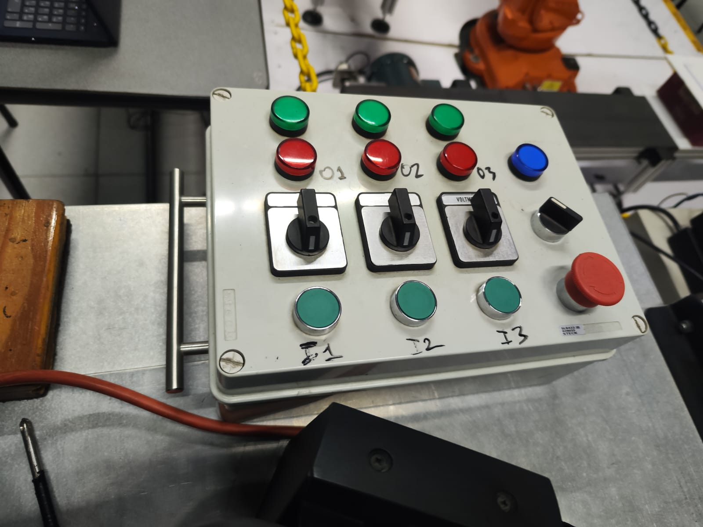
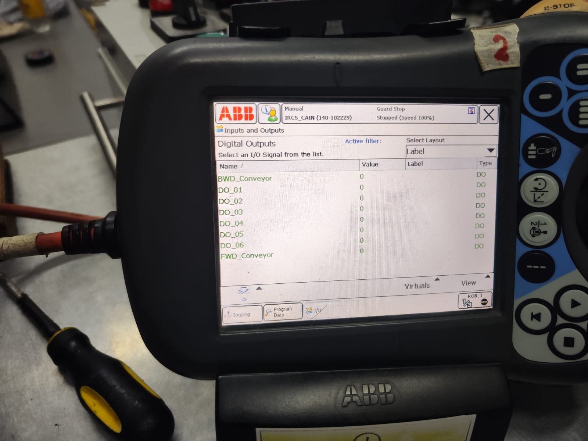

# Lab01 - Robótica Industrial - Trayectorias, Entradas y Salidas Digitales.

# Integrantes

- [José Luis Pulido Fonseca](https://github.com/jpulidof)
- [Jairo David Díaz Luna](https://github.com/AxumII)

# Informe

Indice:

1. [Descripción detallada de la solución planteada](#descripción-detallada-de-la-solución-planteada)
2. [Diagrama de flujo de acciones del robot](#diagrama-de-flujo-de-acciones-del-robot)
3. [Plano de planta de la ubicación de los elementos](#plano-de-planta-de-la-ubicación-de-cada-uno-de-los-elementos)
4. [Descripción de las funciones utilizadas](#descripción-de-las-funciones-utilizadas)
5. [Diseño de la herramienta detallado](#diseño-de-la-herramienta-detallado)
6. [Código en RAPID](#código-en-rapid)
7. [Vídeo de simulación e implementación](#vídeo-de-simulación-e-implementación)
8. [Conclusiones](#conclusiones)

## Descripción detallada de la solución planteada

La propuesta desarrollada consiste en la automatización de una celda de manufactura robótica enfocada en el grabado del texto "DAVID LUIS" sobre una superficie plana denominada `Workobject_Tarta`. El diseño integra la cinemática del brazo robótico con la gestión de periféricos externos, específicamente una banda transportadora, mediante el uso de señales digitales de entrada y salida.

### Lógica de Control y Estados
El sistema opera bajo una estructura cíclica persistente (`WHILE TRUE`) encargada de supervisar tres señales de entrada principales:

* **Ciclo de Producción (`DI_01`):** Constituye la secuencia operativa central. Al activarse, el robot coordina el avance de la banda transportadora (`FWD_Conveyor`) durante 3 segundos para el posicionamiento de la pieza. Posteriormente, el manipulador se dirige al punto de origen (`Target_Home`) e inicia la rutina de dibujo. Al concluir, se acciona nuevamente la banda para la evacuación del objeto y se restablece la señal de estado `DO_01`.
* **Modo de Servicio o Reposo (`DI_02`):** Ejecuta una trayectoria hacia el punto `Target_Rest`, ubicado fuera del volumen de trabajo útil, facilitando labores de mantenimiento, limpieza o sustitución de la herramienta.
* **Gestión Manual de Banda (`DI_03`):** Habilita el control directo y sincronizado de la transportadora en ambas direcciones para realizar ajustes de posición de forma manual.

### Estrategia de Trayectorias
Para asegurar un trazado de alta calidad y prevenir colisiones o daños en el material, se implementaron tres métodos de movimiento:

* **Interpolación Circular (`MoveC`):** Empleada para generar las geometrías curvas presentes en caracteres como la D, S y U, así como en bordes redondeados, garantizando una definición estética precisa.
* **Movimientos Lineales y Articulares (`MoveL` / `MoveJ`):** Se utilizó `MoveJ` para aproximaciones rápidas en trayectorias aéreas y `MoveL` durante la ejecución de los segmentos rectos de las letras para mantener una velocidad constante del trazador.
* **Desplazamientos de Seguridad en Z (`MoverEntreLetras`):** Se diseñó una subrutina basada en la función `Offs` que realiza elevaciones automáticas de 50 mm en el eje vertical al finalizar cada carácter. Esta maniobra asegura que el trazador no raye la superficie durante los tránsitos hacia el inicio del siguiente trazo.

### Herramienta y Entorno
El entorno de trabajo se configuró mediante un sistema de coordenadas de objeto desplazado (`Workobject_Tarta`), lo que permite que las coordenadas de los caracteres sean relativas a la pieza y no a la base del robot. La herramienta `Trazador` se parametrizó con un TCP (Tool Center Point) que compensa su longitud de 170 mm, permitiendo una precisión milimétrica en el contacto con el plano de trabajo.

## Diagrama de flujo de acciones del robot

  

## Plano de planta de la ubicación de cada uno de los elementos

Esta sección detalla la organización espacial de los componentes dentro de la celda robótica. El diseño se estructura en torno a un robot industrial ABB, el cual centraliza las operaciones de trazado sobre el área de trabajo definida.

La configuración física incluye una banda transportadora ubicada estratégicamente dentro del alcance del manipulador para permitir el flujo de las piezas. El objeto de trabajo, denominado Workobject_Tarta, se encuentra posicionado sobre dicha banda. De acuerdo con los datos de calibración, este elemento se localiza en las coordenadas aproximadas de -646 mm en el eje X y -220 mm en el eje Y respecto al origen del robot, con una altura de 412 mm sobre el plano de la transportadora.

Esta disposición garantiza que los puntos de seguridad, tales como la posición Home y la zona de descanso (Target_Rest), se mantengan en sectores libres de colisiones. De este modo, se asegura una transición eficiente entre los estados de espera y producción, permitiendo que el trazador ejecute el nombre David Luis optimizando el volumen de trabajo y respetando los límites cinemáticos del equipo.

## Descripción de las funciones utilizadas

En el desarrollo del programa se emplearon diversas instrucciones estándar del lenguaje RAPID de ABB para garantizar la precisión de las trayectorias y el control efectivo de la celda.

### Instrucciones de Movimiento
* **`MoveJ` (Move Joint):** Utilizada para desplazamientos rápidos y aproximaciones a puntos de seguridad (`Target_Home`, `Target_Mid`) donde la trayectoria exacta de la herramienta no es crítica, permitiendo que el robot alcance la posición de forma eficiente.
* **`MoveL` (Move Linear):** Empleada para los trazos rectos de los caracteres y las elevaciones verticales. Esta función asegura que el TCP (Tool Center Point) se desplace en línea recta a una velocidad constante.
* **`MoveC` (Move Circular):** Fundamental para la creación de las curvas en letras como la **D**, **S** y **U**. Requiere un punto intermedio y un punto final para definir el arco de la trayectoria.
* **`Offs` (Offset):** Función de desplazamiento utilizada para calcular posiciones relativas. En este proyecto, es clave para realizar los saltos de seguridad de 50 mm en el eje Z al finalizar cada letra, evitando el contacto con el objeto durante los tránsitos.

### Control de Entradas y Salidas (I/O)
* **`Set` / `Reset`:** Instrucciones utilizadas para activar y desactivar las señales digitales que controlan el sentido de giro de la banda transportadora (`FWD_Conveyor`, `BWD_Conveyor`).
* **`SetDO`:** Empleada para actualizar el estado de las salidas digitales (`DO_01`, `DO_02`), sirviendo como indicadores de finalización de ciclo o estado del sistema.

### Estructura de Control y Sincronización
* **`WHILE...DO`:** Estructura de bucle infinito que permite al controlador monitorear de forma ininterrumpida las entradas digitales de la estación.
* **`IF...THEN`:** Lógica condicional utilizada para ejecutar subrutinas específicas dependiendo de qué señal de entrada (`DI_01`, `DI_02`, `DI_03`) sea detectada.
* **`WaitTime`:** Implementada para introducir pausas de sincronización (3 segundos para el movimiento de la banda) y para optimizar el uso de la CPU del controlador mediante pausas breves de 0.1 segundos.
* **`PROC` / `ENDPROC`:** Utilizadas para encapsular la lógica en módulos independientes (como la escritura de cada letra o el movimiento entre caracteres), facilitando la lectura y el mantenimiento del código.

## Diseño de la herramienta detallado
Para la ejecución de las trayectorias de marcado, se desarrolló un efector final personalizado consistente en un soporte estructural diseñado para albergar un marcador de punta fina. Este dispositivo fue proyectado para ofrecer una alta rigidez mecánica durante el contacto con la superficie y para facilitar la configuración del punto de control de la herramienta o TCP.

La geometría de la pieza se ajustó a las dimensiones estándar de la brida del robot, incorporando una base circular de 50.03 mm de diámetro con cuatro perforaciones para su anclaje. El cuerpo principal de la herramienta tiene una extensión longitudinal de 148 mm y cuenta con un alojamiento interno de 16 mm de diámetro que asegura la posición del marcador. Un aspecto clave del diseño es la inclinación de 25 grados en el eje de escritura, lo cual optimiza el ángulo de ataque sobre la superficie y mejora la visibilidad del trazado tanto en la simulación como en la implementación física.

En cuanto al ensamble y la puesta a punto, el marcador se integra de forma concéntrica al eje inclinado del soporte, permitiendo que la punta sea el punto de contacto efectivo con el objeto de trabajo. Tras el proceso de fabricación, se realizó la validación técnica en el FlexPendant mediante el método de calibración de cuatro puntos, lo que permitió establecer una longitud final del TCP de 170.341 mm en el eje vertical de la herramienta.

  

  

## Código en RAPID
El código solicitado se puede ver [aquí](./RAPID/Module1.mod).

## Vídeo de simulación e implementación

El video con la simulación se puede encontrar haciendo **[clic aquí](https://drive.google.com/file/d/1XdukO3QPU5nfuVjWRbahXXlz2GR1ej_v/view?usp=sharing)**.

El video con la implementación se puede encontrar haciendo **[clic aquí](https://drive.google.com/file/d/1Qwrxiy7e4FGs6yUoaCdMDN0uOjrZoaaU/view?usp=sharing)**.

### Calibración de Herramienta (TCP)

  

### Calibración de WorkObject

  

  

### Entradas y Salidas (I/O)

  

  

### Resultado Final

  

## Conclusiones

* La sincronización entre el robot y la banda transportadora mediante señales digitales demuestra que una estructura de control basada en monitoreo constante es fiable para gestionar diversos estados operativos.

* El uso combinado de movimientos articulares, lineales y circulares permite equilibrar la rapidez en los desplazamientos aéreos con la alta precisión geométrica necesaria para el trazado de los caracteres.

* La aplicación de la función Offs para realizar elevaciones automáticas entre letras valida la importancia de programar planos de retracción para proteger la integridad de la pieza de trabajo.

* La exactitud del proceso físico confirma que la correcta definición del TCP y el WorkObject es el factor determinante para traducir con éxito la simulación al entorno real.

* La rigidez y el ángulo de ataque del trazador personalizado demuestran que el desarrollo mecánico del efector final es tan crucial para la calidad del resultado como la lógica del código en RAPID.

