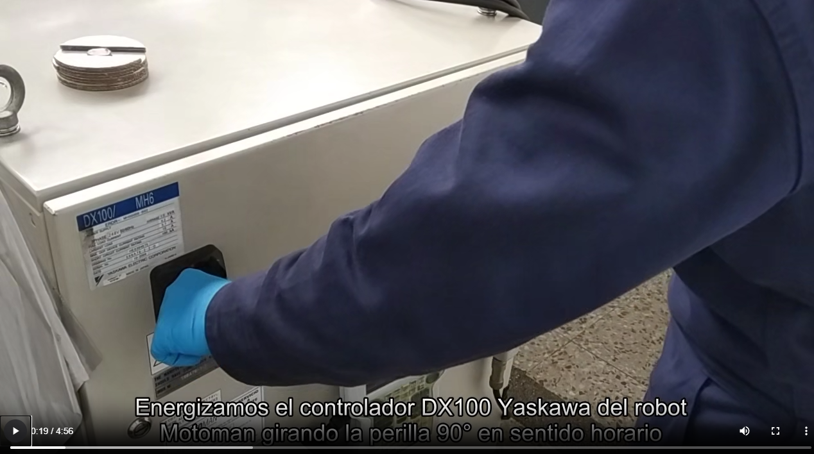
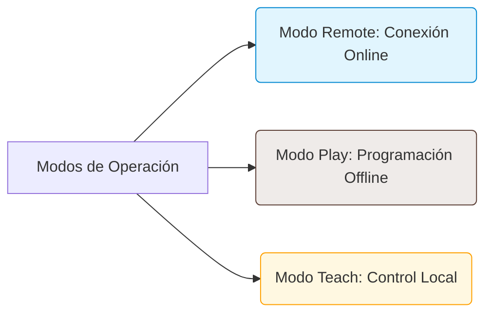
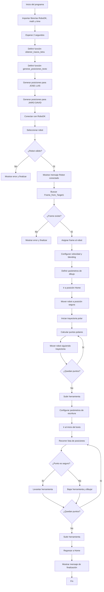

# Lab02 - Robótica Industrial - Analisis y Operaci´on del
Manipulador Motoman MH6.

  

# Integrantes

- [José Luis Pulido Fonseca](https://github.com/jpulidof)
- [Jairo David Díaz Luna](https://github.com/AxumII)

# Informe

## Índice

1. [Cuadro Comparativo: ABB IRB140 vs. Motoman MH6](#cuadro-comparativo-abb-irb140-vs-motoman-mh6)
2. [Descripción de configuraciones Home](#descripción-de-configuraciones-home)
3. [Inicialización del sistema](#inicialización-del-sistema)
4. [Modos de movimiento manuales y control de velocidad](#modos-de-movimiento-manuales-y-control-de-velocidad)
5. [Funcionalidades de RoboDK](#funcionalidades-de-robodk)
6. [Cuadro Comparativo: RoboDk vs RobotStudio](#cuadro-comparativo-robodk-vs-robotstudio)
7. [Diagrama de flujo](#diagrama-de-flujo)
8. [Plano de planta](#plano-de-planta)
9. [Código de RoboDK con trayectoria polar](#código-de-robodk-con-trayectoria-polar)
10. [Video de simulación de RoboDK](#video-de-simulación-de-robodk)

11. [Conclusiones](#conclusiones)

## Cuadro Comparativo: ABB IRB140 vs Motoman MH6

| Categoría | ABB IRB140 | Motoman MH6 |
| :--- | :--- | :--- |
| **Carga máxima** | 6 kg | 6 kg |
| **Alcance** | 810 mm (0.81 m) | 1,422 mm (1.42 m) |
| **Grados de Libertad** | 6 ejes | 8 ejes con Banda |
| **Velocidad Máxima (Eje 1 / Base)** | 200 °/s | 170 °/s |
| **Aplicaciones Típicas** | Ensamblaje, soldadura por arco, limpieza, manipulación de materiales y empaquetado. | Manipulación de materiales, ensamblaje, dispensado, empaquetado, mecanizado de alto nivel. |
| **Masa del Robot** | 98 kg | 130 kg |
| **Repetibilidad** | ±0.03 mm | ±0.08 mm |

## Descripcion de configuraciones Home
### 1. Home 1 (Absolute Home)
* **Posición de las articulaciones:** Todos los ejes se encuentran exactamente a 0° (posición de calibración y alineación de marcas físicas).
  * **S (Base):** 0°
  * **L (Brazo inferior):** 0°
  * **U (Brazo superior):** 0°
  * **R (Giro de muñeca):** 0°
  * **B (Inclinación de muñeca):** 0°
  * **T (Giro de la herramienta):** 0°
* **Descripción:** En esta configuración, el brazo adquiere su postura de calibración de fábrica. Físicamente, todas las marcas de alineación (flechas o muescas en el chasis de cada articulación) coinciden de manera perfecta.
* **Propósito:** Es una posición estricta de mantenimiento. Se utiliza exclusivamente para calibrar el robot, registrar los ceros absolutos de los motores y restablecer el sistema tras una pérdida de memoria (como una alarma *Out of Range*).

  

### 2. Home 2 (Work Home / Posición de Reposo o Trabajo)
* **Posición de las articulaciones:** A diferencia del Home 1, esta es una configuración **definida por el usuario** mediante programación, por lo que los ángulos varían según el diseño de la celda de trabajo. Típicamente, el brazo adopta una postura "plegada" sobre sí mismo (por ejemplo, con el eje L inclinado ligeramente, el eje U cerrado hacia abajo y la muñeca orientada al suelo para proteger la herramienta) aunque depende del entorno diseñado para el robot y las necesidades del usuario.
* **Descripción:** Es la postura segura de inicio, fin de ciclo y espera. El manipulador se retrae a un espacio predefinido donde no interfiere con el proceso.
* **Propósito:** Es el punto de partida seguro para ejecutar trayectorias automáticas y la posición de resguardo cuando el robot está inactivo.

  

No es posible determinar de manera categórica que una configuración sea superior a la otra, dado que ambas cumplen funciones operacionales y de seguridad completamente distintas y complementarias dentro del ciclo de trabajo del manipulador.

* **Home 1 (Absolute Home / Origen Mecánico):** Esta configuración representa el cero geométrico y absoluto del robot, donde todos los ejes coordenados se alinean con sus marcas físicas de calibración de fábrica. Su propósito principal es estrictamente de **mantenimiento, calibración y seguridad pasiva**. Es la postura óptima para el almacenamiento prolongado, el transporte del equipo o para el apagado total del sistema, ya que minimiza los esfuerzos mecánicos estáticos sobre las transmisiones y los frenos de los servomotores al mantener el centro de gravedad alineado verticalmente. También es la posición de referencia obligatoria para restablecer los parámetros del sistema ante fallas críticas de pérdida de memoria o desalineación de los encoders (*Out of Range*).

* **Home 2 (Work Home / Posición de Reposo u Operación):** Esta configuración representa el **cero operativo o de proceso** y es parametrizada por el usuario de acuerdo con las restricciones físicas de la celda. Corresponde al estado seguro de resguardo una vez el controlador DX100 se encuentra energizado y los servomotores están activos (*Servo ON*). Actúa como el punto de partida (origen) y de retorno seguro para la ejecución de trayectorias automáticas en la rutina de grabado, garantizando que el Punto Central de la Herramienta (TCP) inicie fuera de cualquier zona de colisión con los elementos del entorno (como el torno CNC o la estructura de la banda).

Por lo tanto, podemos concluir que es indispensable comprender y documentar con claridad a cuál de las dos configuraciones se hace referencia dentro del código de control. Mientras que Home 1 es una referencia global invariable para la sincronización cinemática del hardware, Home 2 es una referencia local y dinámica supeditada al diseño de la trayectoria y a la optimización de los tiempos de ciclo en la celda de manufactura.
## Inicialización del Sistema

Para realizar la puesta en marcha segura del manipulador Motoman MH6 y su controlador DX100 en el laboratorio, se debe seguir estrictamente la siguiente secuencia de energización y habilitación de seguridad:

1. **Energización de Protecciones Eléctricas:** Localizar el tablero eléctrico de la celda y conmutar a posición de encendido los tres breakers identificados con el rótulo **“MOTOMAN”**.  

  

2. **Habilitación de Potencia General:** Energizar el totalizador general ubicado en el cofre eléctrico de distribución para suministrar la acometida trifásica hacia el armario de control.

  

3. **Encendido del Controlador DX100:** Girar el interruptor principal tipo perilla ubicado en la puerta frontal del controlador DX100 a la posición *ON*. La unidad lógica iniciará su secuencia de booteo del sistema operativo interno.

  

4. **Ergonomía y Gestión del Cableado:** Desenrollar cuidadosamente el cable de comunicación del Teach Pendant, asegurándose de evitar torceduras, lazos o tensiones mecánicas sobre los conectores. Siguiendo las directrices de seguridad industrial del LabSIR, coloque el excedente del cable de manera segura alrededor del cuello para evitar tropiezos o atrapamientos mecánicos en el área de movimiento.

5. **Liberación del Bucle de Emergencia:** Desactivar el estado de paro mecánico girando el botón tipo hongo de parada de emergencia (*Emergency Stop*) del Teach Pendant en sentido horario hasta que sea liberado, rearmando el circuito de seguridad de hardware.

6. **Conmutación al Modo de Enseñanza:** Utilizar la llave física sobre el selector de modos del Teach Pendant (*Mode Switch*) y girarla hacia la posición **TEACH**. Esto transfiere la jerarquía de control absoluto al operador manual e inhabilita los comandos automáticos externos.

  

7. **Navegación en la Interfaz Gráfica:** En el panel de visualización del Teach Pendant, utilizar el menú de navegación principal para seleccionar la opción **Robot**. Esto desplegará los submenús de monitoreo de coordenadas de articulación y de herramienta.

8. **Activación de Servomotores (Servo ON):** Presionar el botón físico **SERVO ON READY** en el teclado. Para energizar los imanes permanentes de los servomotores de los 6 ejes y la banda lineal, el operador debe oprimir y mantener el interruptor de tres posiciones de presencia humana (*Deadman Switch*) en su posición central balanceada. El estado activo de potencia se confirmará cuando el indicador LED verde **SERVO ON** pase de titilar a encendido fijo en el Teach Pendant.

---

## Modos de Movimiento Manuales y Control de Velocidad

La operación y guiado manual del manipulador Motoman MH6 se parametriza combinando la selección de marcos cinemáticos y la atenuación de la velocidad por medio de la interfaz física del hardware.

### Procedimiento de Conmutación de Coordenadas (Tecla COORD)

El cambio entre los distintos modos cinemáticos se realiza mediante pulsaciones cíclicas en la tecla dedicada **COORD** del Teach Pendant. El operador debe validar visualmente el cambio a través del ícono indicador de estado que se actualiza en la barra superior de la pantalla:

  

1. **Movimiento Articular (Joint):** Control individual de eslabones. Al presionar las teclas duales de jog `[+ / -]`, el controlador DX100 envía voltaje directo al lazo de posición de la articulación correspondiente, ignorando las demás. Las teclas físicas mapean directamente los 6 ejes según la nomenclatura nativa de Yaskawa: **S** (Base), **L** (Brazo inferior), **U** (Brazo superior), **R** (Giro de muñeca), **B** (Inclinación de muñeca) y **T** (Giro de la herramienta).

  

2. **Movimiento Cartesiano (Interpolación Espacial):** Los cálculos cinemáticos desacoplan el movimiento empleando el **criterio de Pieper**. El primer grupo de botones básicos manipula las **Traslaciones lineales** del centro de la muñeca respecto al marco de referencia rectangular seleccionado (Base, Robot, Usuario o Herramienta):
   - `X+ / X-`: Traslación positiva o negativa a lo largo del eje longitudinal.
   - `Y+ / Y-`: Traslación lineal lateral.
   - `Z+ / Z-`: Desplazamiento vertical de elevación o penetración.

   Por otro lado, el segundo grupo de botones opera las **Rotaciones de la muñeca esférica** alrededor de dichos ejes espaciales para modificar la orientación de la herramienta sin desplazar el Punto Central de la Herramienta (TCP):
   - `Rx`: Rotación angular (Roll) alrededor del eje X.
   - `Ry`: Rotación angular (Pitch) alrededor del eje Y.
   - `Rz`: Rotación angular (Yaw) alrededor del eje Z.

  

3. **Sistemas de Referencia Adicionales:** Al continuar presionando **COORD**, se habilitan los modos **Herramienta (Tool)** —donde los ejes $X,Y,Z$ se trasladan y rotan solidarios a la pinza o antorcha actual— y **Usuario (User)** —útil para alinear los movimientos manuales con los planos inclinados del Torno CNC o mesas de trabajo de la celda—.

---

### Procedimiento de Ajuste de Velocidad Manual (Teclas FAST / SLOW)

Para mitigar riesgos de colisión y cumplir las normativas de seguridad en el modo de enseñanza, el Teach Pendant cuenta con una sección dedicada al control fino de la velocidad manual. El operario debe variar la tasa de alimentación dinámica mediante dos pulsadores físicos:

1. **Disminución de velocidad (Tecla SLOW):** Cada pulsación reduce el porcentaje de velocidad del robot en modo manual, transitando por los estados de control hasta alcanzar el modo **Inching** (movimiento incremental por pulsos discretos milimétricos, idóneo para la aproximación de puntos críticos).
2. **Aumento de velocidad (Tecla FAST):** Incrementa el escalonamiento de la velocidad permitiendo desplazamientos más largos y fluidos a través de las categorías estándar:
   - `SLOW` (Baja velocidad / Precisión extrema)
   - `FAST` (Velocidad media operacional para jog)
   - `HIGH SPEED` (Velocidad máxima restringida permitida bajo modo Teach)

El operador tiene la obligación técnica de verificar el nivel de velocidad actual inspeccionando el indicador gráfico (grillas de barras acumulativas) situado en el extremo superior de la pantalla LCD antes de efectuar cualquier rutina de desplazamiento.

  

## Funcionalidades de RoboDK

El software RoboDK se consolida en la actualidad como una de las herramientas de Programación Offline (OLP) y simulación cinemática más versátiles de la robótica industrial moderna. A diferencia de los entornos propietarios orientados a una única marca, su arquitectura abierta permite integrar y sincronizar múltiples periféricos y manipuladores de diversos fabricantes dentro de una misma celda de manufactura flexible.

### Aplicaciones Principales y Capacidades en la Célula de Trabajo

Dentro del contexto de esta práctica de laboratorio, las capacidades del entorno virtual se agrupan en cuatro ejes fundamentales:

1. **Programación Offline (OLP) Multi-marca:** Permite el modelado bidireccional y la definición rigurosa de marcos de referencia coordenados (*Frames*), geometrías de piezas y configuraciones de herramientas (*TCP*). Asimismo, integra algoritmos avanzados para el trazado de trayectorias complejas sobre superficies y la detección automatizada de colisiones o singularidades mecánicas antes de interactuar con el hardware real.
2. **Entorno Abierto mediante APIs:** RoboDK rompe la restricción de los lenguajes de programación propietarios a través de sus APIs nativas para lenguajes de alto nivel como **Python**, C#, C++, Matlab y Java. Esto permite automatizar la importación de archivos CAD tridimensionales, realizar el cálculo analítico de poses y parametrizar geométricamente las trayectorias directamente desde el código.
3. **Optimización de Procesos de Grabado y Maquinado:** El software es capaz de procesar de manera directa archivos de trayectorias complejas (como estructuras algebraicas en coordenadas polares, curvas spline o código G-code de maquinado CNC), convirtiéndolas automáticamente en aproximaciones lineales (`MoveL`) y articulares (`MoveJ`) optimizadas para el brazo robótico.
4. **Validación Cinemática sin Hardware:** Permite simular y depurar el comportamiento dinámico completo del robot en ausencia del controlador físico. El software valida de antemano si los puntos programados se encuentran dentro del espacio de alcance (*Workspace*) del Motoman MH6 y si los movimientos saturan los límites angulares de sus 6 ejes o de la banda lineal.

---

### Mecanismos y Modos de Comunicación con el Controlador Motoman

La interacción entre el software de simulación y el controlador físico DX100 de Yaskawa se clasifica de acuerdo con la jerarquía de control y la infraestructura de red en tres modalidades operacionales:

#### A. Modo Remote (Control Online por Driver Ethernet)

En esta configuración, RoboDK actúa como el maestro del lazo de control enviando comandos cinemáticos en tiempo real al controlador mediante un cable de red industrial.

* **Requisitos y Procedimiento:** Se requiere asignar una IP estática compatible en el computador y en el controlador DX100. En la interfaz física del robot, el selector de llave debe conmutarse a la posición **REMOTE** con los servomotores activos (*Servo ON*). Dentro del entorno gráfico de RoboDK, se hace clic derecho sobre el ícono del robot $\rightarrow$ **Conectar al robot**, se digita la dirección IP junto con el puerto de comunicación y se inicializa el driver nativo de Motoman. El script de Python puede automatizar esta acción invocando el comando `robot.Connect()`.
* **Ventajas:** Brinda una respuesta inmediata. Permite el guiado manual (*Jogging*) desde el PC, la validación interactiva de las coordenadas del TCP y la monitorización en vivo del estado de los registros de entrada y salida (I/O).

#### B. Modo Play (Programación Offline + Transferencia de Archivos .JBI)

Este método descentraliza la simulación de la ejecución física, operando mediante la compilación y almacenamiento local de las rutinas de movimiento.

* **Procedimiento:** Una vez validada la trayectoria matemática en el entorno virtual, se utiliza la función **Program $\rightarrow$ Generate Program**. RoboDK procesa el árbol de comandos y, a través de su postprocesador específico para Yaskawa INFORM, compila un archivo con extensión nativa **.JBI** (compuesto por coordenadas expresadas en pulsos de encoder o variables cartesianas). Este archivo se transfiere al controlador DX100 mediante una unidad de almacenamiento USB o un servidor FTP. Finalmente, el operario selecciona el *Job* desde el Teach Pendant y ejecuta la secuencia en modo automático presionando **PLAY**.
* **Ventajas:** Máxima seguridad y autonomía. No requiere mantener un computador conectado de forma permanente a una red abierta y elimina la latencia de comunicación del driver.

#### C. Modo Teach (Aislamiento y Configuración Local)

Representa la operación clásica de planta donde el software de simulación pasa a un segundo plano. El operador adquiere el control manual exclusivo del manipulador por medio del Teach Pendant en modo **TEACH**. Sirve para registrar puntos de referencia espaciales iniciales que posteriormente se transcriben o sincronizan con las coordenadas del gemelo digital en RoboDK.

---

### Integración e Implementación de Código Python en RoboDK

Para la ejecución de la trayectoria analítica polar de esta práctica, el script desarrollado en Python puede integrarse en el entorno de RoboDK a través de tres alternativas de despliegue:

* **Opción A (Script Integrado en Estación):** Se añade un elemento de código directamente en el entorno virtual seleccionando **Station $\rightarrow$ Add $\rightarrow$ Python Program**. Esto despliega un editor de texto integrado donde se aloja el código; al ejecutarse (`Run`), la simulación gráfica y los comandos del robot se procesan de forma inmediata.
* **Opción B (Llamado Externo de Script):** Desde la barra de herramientas superior, se navega en la ruta **Tools $\rightarrow$ Run Script** y se selecciona externamente el archivo con extensión `.py` desarrollado por el equipo de trabajo.
* **Opción C (Entorno de Programación Externo / IDE):** Se realiza la instalación de las librerías de comunicación en el sistema operativo a través del gestor de paquetes (`pip install robodk`). Manteniendo la aplicación de RoboDK abierta en segundo plano, el script se ejecuta desde un IDE externo (como VS Code o una terminal de comandos). El objeto `Robolink()` busca automáticamente la instancia activa del software por medio de sockets locales y toma el control de la simulación.

 Durante la fase preliminar de pruebas empleando la API de Python, se debe establecer la variable lógica `robot.Connect()` en estado de simulación pura para comprobar la ausencia de colisiones y validar los rangos cinemáticos. Al realizar la transición al entorno real, es una obligación estricta parametrizar velocidades de aproximación atenuadas mediante `robot.setSpeed()` y radios de curvatura conservadores con `robot.setRounding()`, manteniendo siempre el control sobre el interruptor de Parada de Emergencia de la celda.

## Cuadro Comparativo: RoboDK vs. RobotStudio

| Categoría | RoboDK | RobotStudio |
| :--- | :--- | :--- |
| **Compatibilidad de Marcas** | **Multi-marca:** Soporta más de 50 fabricantes (ABB, Yaskawa/Motoman, Fanuc, KUKA, etc.). | **Exclusivo de ABB:** Diseñado específicamente para robots ABB. |
| **Lenguaje de Programación** | Basado en **Python**, C#, C++, y soporte para integración externa. | Basado en **RAPID** (lenguaje propietario de ABB). |
| **Fidelidad de Simulación** | Simulación cinemática y geométrica de alta precisión. | Máxima fidelidad. Utiliza el "Virtual Controller" idéntico al del hardware real. |
| **Programación Offline (OLP)** | Muy versátil; permite generar código para casi cualquier post-procesador. | Optimizado para ABB; permite la sincronización total entre la simulación y el controlador real. |
| **Costo y Licencia** | Licencia comercial más asequible y opción de licencia perpetua aunque la universidad NO TIENE. | Modelo de suscripción premium; la universidad SI TIENE LICENCIA. |
| **Curva de Aprendizaje** | **Baja/Media:** Interfaz intuitiva orientada a la facilidad de uso e integración con herramientas del lenguaje a elección. | **Alta:** Entorno profesional muy denso y restrictivo pero segmentado con un lenguaje incómodo. |
| **Post-procesadores y Flexibilidad** | **Muy Alta:** Permite modificar o crear post-procesadores fácilmente mediante scripts de Python para adaptar el código a formatos específicos (como los pulsos del controlador DX100 de Yaskawa). | **Baja (Fuera de ABB):** No genera código nativo ejecutable para controladores de otras marcas sin un ecosistema de conversión externo y complejo. |
| **Integración de Componentes de Celda (Track/Tornos)** | Fácil importación de archivos CAD tridimensionales y sincronización directa con mecanismos externos estándar como ejes lineales adicionales (*tracks*). | Excelente sincronización de sistemas de movimiento avanzados (MultiMove), pero fuertemente optimizada para el hardware periférico de la marca ABB. |
| **Concepto de Gemelo Digital** | Enfocado en la validación geométrica de trayectorias, alcances y evasión de colisiones espaciales mediante un entorno gráfico ágil. | Enfocado en el gemelo digital completo (lógica interna, tiempos de ciclo reales de escaneo, señales I/O idénticas y simulación de la física del controlador). |
| **Optimización de Trayectorias complejas** | Excelente para conversión directa de trayectorias complejas de manufactura (impresión 3D, maquinado CNC por G-code o trayectorias polares analíticas) a código robótico. | Excelente para programación estructurada de lógica industrial compleja, paletizado avanzado y control cinemático de alta precisión nativo de la marca. |
### Análisis para el Laboratorio

Dado que la universidad cuenta con licenciamiento activo para RobotStudio pero carece de licencias comerciales vigentes para RoboDK, la toma de decisiones técnicas para el despliegue de celdas flexibles debe evaluar rigurosamente la relación costo-beneficio y la arquitectura del hardware disponible. A partir de los datos recopilados y las pruebas empíricas en el laboratorio, se estructuran las siguientes discusiones analíticas:

#### 1. Versatilidad Multi-marca frente a la Dependencia de Ecosistema
La implementación del script en Python evidenció la flexibilidad operativa que ofrece RoboDK al configurar entornos de manufactura heterogéneos. Mientras que suites como RobotStudio restringen de forma absoluta su compatibilidad a manipuladores de la marca ABB mediante su lenguaje propietario RAPID, RoboDK facilitó la integración directa del brazo Motoman MH6 de Yaskawa sin depender del software nativo del fabricante (MotoSim). Esta interoperabilidad es un factor clave en la automatización industrial real, donde es común la coexistencia de equipos de múltiples marcas. Sin embargo, trabajar con la versión educativa/limitada de RoboDK introduce restricciones significativas en la exportación de archivos y el uso de post-procesadores avanzados, un obstáculo que no se presenta con RobotStudio en este laboratorio debido al licenciamiento institucional completo con el que se cuenta.

#### 2. El Impacto Cinemático del Eje Lineal Adicional (Track)
La integración del riel lineal como eje de desplazamiento longitudinal dota al Motoman MH6 de la celda de un total de 8 grados de libertad efectivos. Desde la perspectiva cinemática, esta condición transforma al manipulador en un **sistema redundante** para tareas convencionales de posicionamiento en el espacio ($XYZ$). El uso de RoboDK simplifica notablemente la resolución de este problema al permitir acoplar el *track* de forma gráfica o definirlo como una constante de traslación del marco de referencia. En la práctica, esta adición expande drásticamente el espacio de trabajo útil (*Workspace*) del robot —permitiéndole interactuar tanto con la estación de alimentación como con el Torno CNC—, una capacidad cuya programación por métodos analíticos tradicionales en el controlador físico habría resultado sumamente compleja.

## Diagrama de flujo

## Plano de planta
Se puede apreciar las configuraciones en físico y en simulación del robot en su entorne

  

  

  

## Código de RoboDK con trayectoria polar
**Script de Control Principal:** [`RosPolar.py`](./RosPolar.py)

## Video de simulación de RoboDK
[Ver en YouTube: Tutorial Motoman MH6 DX100](https://youtu.be/DAqCGlMtjmA)

Nota: Por problemas de licencia, no se pudo implementar en físico la simulación del Motoman.

## Conclusiones

* **Eficiencia en Programación Offline (OLP):** La implementación del algoritmo en Python mediante RoboDK demostró que el uso de APIs abiertas reduce drásticamente los tiempos de puesta en marcha del hardware en comparación con el guiado manual. La capacidad de calcular trayectorias complejas de manera analítica y transferirlas directamente al robot optimiza significativamente la ingeniería de procesos en la celda.
* **Jerarquía de Seguridad en Marcos de Referencia:** El análisis de las posiciones iniciales evidenció que la seguridad operativa depende de una correcta jerarquía de coordenadas. Mientras que el Home 1 (Absolute Home) funciona como una referencia invariable de fábrica para calibración y mantenimiento, el Home 2 (Work Home) es un cero operativo que protege mecánicamente la herramienta al posicionarla fuera de cualquier vector de colisión dentro de la celda.
* **Gestión de Redundancia y Continuidad Dinámica:** La adición del eje longitudinal (Track) amplía notablemente el espacio de trabajo del Motoman MH6, transformándolo en un sistema redundante de 8 grados de libertad. El éxito en el trazado continuo de las curvas y los nombres confirma que la interpolación cartesiana coordinada, basada en el criterio de Pieper, permite al controlador DX100 absorber de forma eficiente las restricciones mecánicas e inercias reales mediante sus funciones de suavizado.

