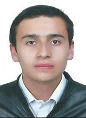

<picture>
    <source srcset="https://imgur.com/5bYAzsb.png" media="(prefers-color-scheme: dark)">
    <source srcset="https://imgur.com/Os03JoE.png" media="(prefers-color-scheme: light)">
    
</picture>

<h3>Curso de Robótica 2026-I</h3>

<h1>Compilado de Informes de Laboratorio de Robótica</h1>

<h2>Profesores:  Pedro Fabián Cárdenas Herrera   Manuel Felipe Carranza Montenegro</h2>

<h4>José Luis Pulido Fonseca 
    Jairo David Díaz Luna</h4>

  
  
  
  
  
  
  
  
  
  
  
  
  

---

## Descripción

Este repositorio corresponde al desarrollo de las actividades del curso de **Robótica 2026-I**.  
Aquí se documentan los laboratorios, avances, resultados y la presentación de los integrantes del equipo.

---

## Objetivos del repositorio

- Organizar el desarrollo de los laboratorios del curso.
- Documentar procedimientos, resultados y evidencias.
- Presentar formalmente a los integrantes del equipo.
- Mantener una estructura clara y ordenada para la evaluación.

---

## Integrantes del equipo

### Integrante 1

   

- **Nombre completo:** José Luis Pulido Fonseca
- **Carrera:** Ingeniería Mecatrónica
- **Correo institucional:** jpulidof@unal.edu.co
- **Usuario de GitHub:** [jpulidof](https://github.com/jpulidof)
- **Rol en el equipo:** Documentación, simulación.
- **Intereses:** Robótica móvil, automatización industrial, control.
- **Descripción breve:**  
  Soy una persona proactiva, curiosa e interesada en todo tipo de tecnologías.
---

### Integrante 2

   

- **Nombre completo:** Jairo David Díaz Luna 
- **Carrera:** Ingeniería Mecatrónica
- **Correo institucional:** jdiazlu@unal.edu.co 
- **Usuario de GitHub:** [Axum-User](https://github.com/Axum-User)
- **Rol en el equipo:** Control, diseño.
- **Intereses:** Manipulación, ROS 2, DIY.
- **Descripción breve:**  
  Mi enfoque es automatizar todo y hacer lo más amigable al usuario.

